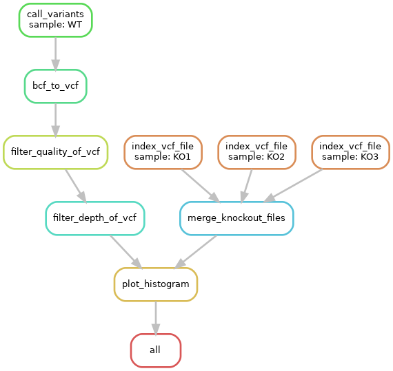

# Dataprocessing_Endassignment

This pipeline is an automated BASH/R pipelinem, made in snakemake, for the efficient visualization of RNA-seq variants on the mouse mm10 build. The pipeline takes as input BAM files from RNA-Seq, WES or WGS, calls variants in each sample with Freebayes, intersects variants from each genotype and outputs filtered VCF files per genotype, genome-wide plots of variants. For this pipeline to work, it is required that a virtual python enviroment is setup and that snakemake is installed in that virtual enviroment. Inputs could be BAM files from a splice-aware aligner like HISAT2, Bowtie2, or BWA (for WES/WGS data).

The reference pipeline can be found [here](https://github.com/cfarkas/Genotype-variants)

## Overview of the pipeline



The BAM files used in this pipeline can be found [here](https://usegalaxy.org/u/carlosfarkas/h/test-sall2-ko-rna-seq-gse123168-1)

The mouse reference genome 2bit file used can be found [here](http://hgdownload.cse.ucsc.edu/goldenpath/mm10/bigZips/mm10.2bit)

To convert the 2bit file to fasta, a script (only available for MAC and linux) is required which can be found [here](http://hgdownload.cse.ucsc.edu/admin/exe/)

To create the virtual enviroment open a terminal and put in the following code
```
# Creating a virual enviroment
virtualenv -p /usr/bin/python3 venv

# Activate the enviroment
source venv/bin/activate

# Installing snakemake
pip3 install snakemake

# Deactivate the enviroment
deactivate
```

To run the pipeline write the following line in the terminal. Make sure the virtual enviroment is activated. *nCores* is a number indicating the amount of cores the pipeline is allowed to use.

```
snakemake -c[nCores]
```
After the pipeline has run the results will be available in the results directory. If however, an error occurred, you should check the log files in the log_files directory to see what went wrong.